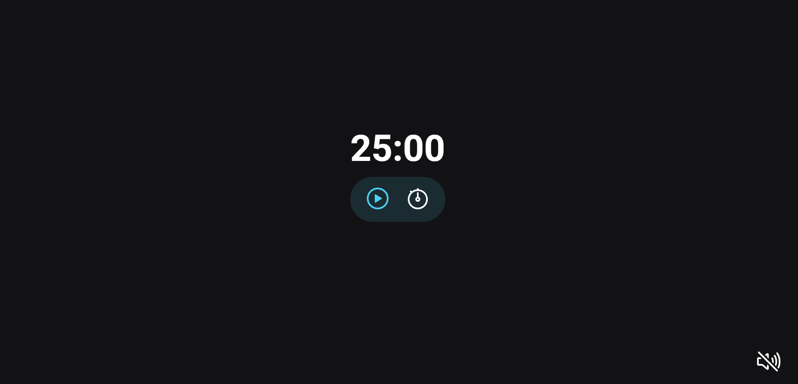

<h1 align="center">⏲️ Focus Timer</h1>

    <a style="font-size: 18px" href="https://andregrasel.github.io/Explorer/nivel05/stage/focusTimer" target="_blank"> Veja o Site</a>

 

## 💻 Projeto

Temporizador para ajudar no foco.

- Pode definir um tempo espcífico.
- Pode dar play, pause e resetar o timer.
- Pode ativar ou não um som de fundo.

## 📥 Conhecimento adquirido

- Manipulação da DOM
- Eventos
- Audio Object
- ES6 Modules
- Padrão Factory
- Injeção de Dependências
- Clean Code
- Refatoração de Código

## 🛠 Tecnologias usadas

- [HTML](https://www.w3schools.com/html/)
- [CSS](https://www.w3schools.com/css/default.asp)
- [JavaScript](https://developer.mozilla.org/pt-BR/docs/Web/JavaScript)
- [Figma](https://www.figma.com/design/)

 
 

 

<a href="../README.md">Voltar</a>
